# Workflow of Tasks

*Replace all bracketed prompts with information specific to your proposed system. Delete instructional text that does not belong in your final specification. Add or remove task sections as needed. Every task shown in the general workflow must have a corresponding task specification below.*

## 1. Workflow Overview
### 1.1 Workflow Goal
This workflow supports the system goal defined in `my_first_agent/README.md`.

### 1.2 Workflow Trigger

The workflow begins when a CPVC organizer creates a new hackathon event in EmpirePulse and uploads the current registration list. It runs again on a scheduled basis as the event approaches or when participants update their attendance status.

### 1.3 Completion Condition at Runtime

The workflow is complete when EmpirePulse has processed the available registration and confirmation data, generated an attendance estimate with a confidence range, calculated recommended food, drink, and the swagger quantities, and delivered the planning summary to the CPVC organizers. Any missing or uncertain data must be clearly flagged.

### 1.4 General Workflow

EmpirePulse imports the event’s registration list, validates the data, and combines it with the club’s historical attendance rate, currently about 40%. As the event approaches, it may send a limited number of privacy-conscious confirmation requests and record participant responses. The system then estimates likely attendance, provides a confidence range, and recommends quantities of food, drinks, and swag. It presents these results in a planning summary for CPVC organizers.
If registration data is missing, duplicated, or inconsistent, EmpirePulse flags the affected records for organizer review. When confirmation responses are limited, forecast confidence is low, or recommendations exceed the event’s budget or venue capacity, the system presents alternative planning scenarios and requests a human decision. Organizers must approve participant communications and final purchasing quantities; EmpirePulse does not place orders automatically.

### 1.5 Workflow Diagram

[Insert a flowchart showing the tasks in sequence. Label each task with a task number and short name. Show decision branches, loops, review points, and possible stopping conditions. Below is an example of a Mermaid. You can either edit the mermaid below yourself or ask ChatGPT to generate a Mermaid script based on your workflow description above. Give every task a unique ID, such as T1, T2, and T3, and name tasks using a verb and an object in the mermaid.]

```mermaid
flowchart TD
    S0["Workflow trigger: CPVC organizer creates a new hackathon event and uploads the current registration list, a scheduled run occurs as the event approaches, or a participant updates attendance status"] --> T1["Import event registration list"]
    T1 --> T2["Validate registration data"]
    T2 --> D1{"D1: Is registration data missing, duplicated, or inconsistent?"}
    D1 -->|Yes| T3["Flag affected registration records for organizer review"]
    T3 --> T4["Review affected registration records"]
    T4 --> D2{"D2: Have organizers resolved the affected records?"}
    D2 -->|Yes| T2
    D2 -->|No| T5["Record missing or uncertain registration data"]
    D1 -->|No| T6["Combine registration data with the historical attendance rate of about 40%"]
    T5 --> T6
    T6 --> D3{"D3: Should participant confirmation requests be sent?"}
    D3 -->|Yes| T7["Request organizer approval for participant communications"]
    T7 --> D4{"D4: Have organizers approved participant communications?"}
    D4 -->|Yes| T8["Send limited privacy-conscious confirmation requests"]
    T8 --> T9["Record participant confirmation responses"]
    D4 -->|No| T10["Estimate likely attendance"]
    D3 -->|No| T10
    T9 --> T10
    T10 --> T11["Generate attendance confidence range"]
    T11 --> D5{"D5: Are confirmation responses limited or forecast confidence low?"}
    D5 -->|Yes| T12["Present alternative planning scenarios and request a human decision"]
    T12 --> T13["Review alternative planning scenarios"]
    T13 --> D6{"D6: Has an organizer made a planning decision?"}
    D6 -->|Yes| T14["Apply organizer planning decision"]
    D6 -->|No| T12
    D5 -->|No| T15["Calculate recommended food, drink, and swag quantities"]
    T14 --> T15
    T15 --> D7{"D7: Do recommendations exceed the event budget or venue capacity?"}
    D7 -->|Yes| T12
    D7 -->|No| T16["Generate planning summary with attendance estimate, confidence range, recommendations, and data flags"]
    T16 --> T17["Deliver planning summary to CPVC organizers"]
    T17 --> T18["Request organizer approval for final purchasing quantities"]
    T18 --> D8{"D8: Have organizers approved final purchasing quantities?"}
    D8 -->|Yes| E0["Completion: available registration and confirmation data are processed, an attendance estimate and confidence range are generated, recommended quantities are calculated, the planning summary is delivered, and missing or uncertain data are flagged"]
    D8 -->|No| E1["Stopping condition: final purchasing quantities are not approved"]
```

